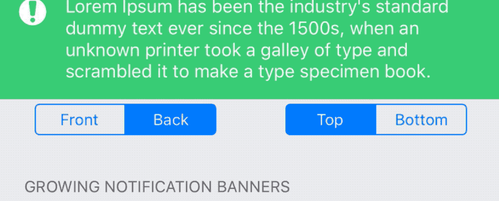
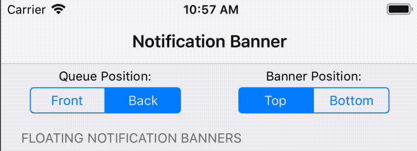
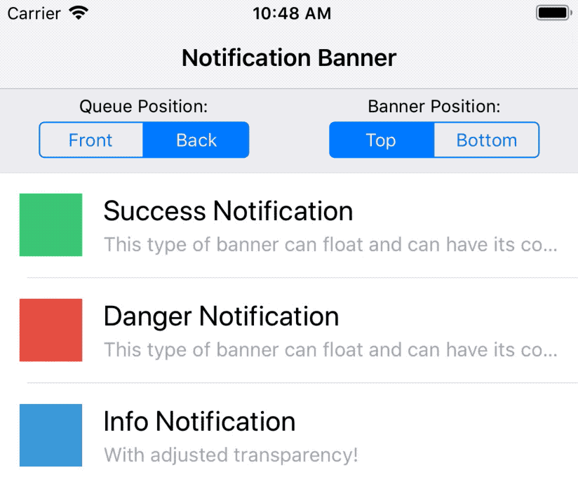
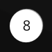
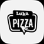

[](http://cocoapods.org/pods/NotificationBannerSwift)
<a href="https://github.com/Carthage/Carthage/"></a>
[](http://cocoapods.org/pods/NotificationBannerSwift)
<a href="https://developer.apple.com/swift"></a>
[](http://cocoapods.org/pods/NotificationBannerSwift)

## Written in Swift 5

NotificationBanner is an extremely customizable and lightweight library that makes the task of displaying in app notification banners and drop down alerts an absolute breeze in iOS.

| Basic Banners | Banners with Side Views  | Status Bar Banners |
| ------------- | ------------- | ------------- |
|   |   |  |

| Growing Banners | Floating Banners  | Stacked Banners |
| ------------- | ------------- | ------------- | 
|   |  |  |

## Features
- Highly customizable ✅
- `NSAttributedString` support ✅
- iPhone, iPhoneX, & iPad Support ✅
- Orientation change support ✅
- Custom `UIView` support ✅
- Custom colors support ✅
- Support for long titles/ subtitles ✅
  - `NotificationBanner` uses horizontal scrolling labels
  - `GrowingNotificationBanner` grows in height as needed
- Presenting from top or bottom support ✅
- Haptic feeback support ✅
- Built in banner queue ✅
- Allow to display several banners simultaneously, configurable in banners queue

## Requirements

 - iOS 10.0+
 - Xcode 10.0+

## Installation

### CocoaPods

NotificationBanner is available through [CocoaPods](http://cocoapods.org). To install
it, simply add the following line to your Podfile:

#### Swift 5 + xCode 11 + iOS 13 Support

```ruby
pod 'NotificationBannerSwift', '~> 3.0.0'
```

#### Swift 5 + xCode 10.x

```ruby
pod 'NotificationBannerSwift', '2.5.0'
```

#### Swift 4.2

```ruby
pod 'NotificationBannerSwift', '2.0.1'
```

#### Swift 4.0

```ruby
pod 'NotificationBannerSwift', '1.6.3'
pod 'MarqueeLabel/Swift', '3.1.6'
```

Then add `import NotificationBannerSwift` at the top of each file you use NotificationBanner in your project.

### Carthage

To use NotificationBanner via Carthage simply add this line to your `Cartfile`:

#### Swift 5
```swift
github "Daltron/NotificationBanner" "master"
```

Then add `NotificationBanner.framework` and the dependencies `SnapKit.framework` and `MarqueeLabel.framework` in your project.

## Usage

Creating drop down alerts with NotificationBanner is easy. To create a regular banner (with scrolling labels) and show it, simply:

```swift
let banner = NotificationBanner(title: title, subtitle: subtitle, style: .success)
banner.show()
```

If you want to create a banner which grows in height as needed and show it accordingly just use `GrowingNotificationBanner` instead of `NotificationBanner`:

```swift
let banner = GrowingNotificationBanner(title: title, subtitle: subtitle, style: .success)
banner.show()
```

To create a status bar alert, simply:

```swift
let banner = StatusBarNotificationBanner(title: title, style: .success)
banner.show()
```

By default, each banner will be displayed on the main application window. If you are wanting to show a banner below a navigation bar, simply show on the view controller that is within the navigation system:

```swift
banner.show(on: viewController)
```

By default, each banner will present from the top. If you are wanting to display from the bottom, simply:

```swift
banner.show(bannerPosition: .bottom)
```

Each of the show properties defined above can be mixed and matched to work flawlessly with eachother.

By default, each banner will automatically dismiss after 5 seconds. To dismiss programatically, simply:

```swift
banner.dismiss()
```

To show a banner infinitely until it is manually dismissed, simply:

```swift
banner.autoDismiss = false
```

NotificationBanner has five prebuilt styles that you can choose from:

```swift
public enum BannerStyle {
    case danger
    case info
    case customView
    case success
    case warning
}
```

You can override the predefined colors that NotificationBanner uses for any style by conforming to the `BannerColorsProtocol`:

```swift
public protocol BannerColorsProtocol {
    func color(for style: BannerStyle) -> UIColor
}
```

Its as easy as creating a custom banner colors class:

```swift
class CustomBannerColors: BannerColorsProtocol {

    internal func color(for style: BannerStyle) -> UIColor {
        switch style {
            case .danger:	// Your custom .danger color
            case .info:		// Your custom .info color
            case .customView:	// Your custom .customView color
            case .success:	// Your custom .success color
            case .warning:	// Your custom .warning color
        }
    }

}
```

And then passing in that class to any notification banner you create:

```swift
let banner = NotificationBanner(title: title, style: .success, colors: CustomBannerColors())
banner.show()
```

By default, the `.info` style will be applied to the banner if no style is provided in the init method. You can set the background color of a banner at any time by simply setting the `backgroundColor`.


### Banners with Side Views

A notification banner can have a left accessory view, a right accessory view, or both:

```swift
// Success Style Notification with Left View
let leftView = UIImageView(image: #imageLiteral(resourceName: "success"))
let banner = NotificationBanner(title: title, subtitle: subtitle, leftView: leftView, style: .success)
banner.show()

 // Danger Style Notification with Right View
let rightView = UIImageView(image: #imageLiteral(resourceName: "danger"))
let banner = NotificationBanner(title: title, subtitle: subtitle, rightView: rightView, style: .danger)
banner.show()    

// Info Style Notification with Left and Right Views
let leftView = UIImageView(image: #imageLiteral(resourceName: "info"))
let rightView = UIImageView(image: #imageLiteral(resourceName: "right_chevron"))
let banner = NotificationBanner(title: title, subtitle: subtitle, leftView: leftView, rightView: rightView, style: .info)
banner.show()
```


Each side view will be automically reisized to fit perfectly

### Banners with a Custom View

A notification banner can also be initalized with a custom view:

```swift
let banner = NotificationBanner(customView: NorthCarolinaBannerView())
banner.show()
```


### Handling User Interaction

By default, when a banner is tapped or swiped up by a user, it will be dismissed. If you want to detect when the user taps or swipes up on a banner, simply:

```swift
banner.onTap = {
	// Do something regarding the banner
}
```

```swift
banner.onSwipeUp = {
	// Do something regarding the banner
}
```

### Banner Events

You can choose to opt into a notification banner's events by registering as its delegate:

```swift
banner.delegate = self
```
Then just make sure to implement the following methods:

```swift
internal func notificationBannerWillAppear(_ banner: BaseNotificationBanner)
internal func notificationBannerDidAppear(_ banner: BaseNotificationBanner)
internal func notificationBannerWillDisappear(_ banner: BaseNotificationBanner)
internal func notificationBannerDidDisappear(_ banner: BaseNotificationBanner)
```

## Haptic Feedback Support
By default, when a banner is displayed, a haptic feedback will be generated on devices that support it. The types of haptic feedback are as follows:

```swift
public enum BannerHaptic {
    case light
    case medium
    case heavy
    case none
}
```

To change the type of haptic feedback to generate when a banner is shown, simply:

```swift
banner.haptic = .heavy
```

## Banner Queue

By default, each notification banner is placed onto a singleton of an auto-managed `NotificationBannerQueue`. This allows an infinite amount of banners to be displayed without one hiding the other. If you have multiple controllers within your navigation stack that need to be managed by a seperate queue (like a tab bar controller), simply create an instance of a `NotificationBannerQueue` and pass it in to the show function:

```swift
banner.show(queue: customQueue)
```

By default, each notification banner is placed on the back of the queue. If you would rather place the banner in the front and show it immediately no matter how many banners are in the queue, simply state it in the `show()` method:

```swift
banner.show(queuePosition: .front)
```

Adding a banner to the front of the queue will temporarily suspend the currently displayed banner (if there is one) and will resume it after the banner in front of it dismisses.

To get the number of banners currently on the queue, simply:

```swift
let numberOfBanners = NotificationBannerQueue.default.numberOfBanners
```

 <b>This is all automatically managed!</b>

## Banner Queue and display banners simultaneously (stacked)

You can also create the queue to display several banners at once with controlling of maximum number of banners to be displayed simultaneously. You can "show" more banners than allowed by queue settings - banners what exceed this value will be displayed some time later, after some banners already displayed on screen will be closed. In example below we create queue with maximum simultaneous banners allowed - 3:

```swift
let bannerQueueToDisplaySeveralBanners = NotificationBannerQueue(maxBannersOnScreenSimultaneously: 3)
```

Create five different banners:

```swift
let banner1 = FloatingNotificationBanner(title: "Success Notification - 1",
                                         subtitle: "First Notification from 5 in current queue with 3 banners allowed simultaneously",
                                         style: .success)
banner1.delegate = self

let banner2 = FloatingNotificationBanner(title: "Danger Notification - 2",
                                         subtitle: "Second Notification from 5 in current queue with 3 banners allowed simultaneously",
                                         style: .danger)
banner2.delegate = self

let banner3 = FloatingNotificationBanner(title: "Info Notification - 3",
                                         subtitle: "Third Notification from 5 in current queue with 3 banners allowed simultaneously",
                                         style: .info)
banner3.delegate = self

let banner4 = FloatingNotificationBanner(title: "Success Notification - 4",
                                         subtitle: "Fourth Notification from 5 in current queue with 3 banners allowed simultaneously",
                                         style: .success)
banner4.delegate = self

let banner5 = FloatingNotificationBanner(title: "Info Notification - 5",
                                         subtitle: "Fifth Notification from 5 in current queue with 3 banners allowed simultaneously",
                                         style: .info)
banner5.delegate = self
```

and show all five banners at once:
```swift
showBanners([banner1, banner2, banner3, banner4, banner5],
            in: bannerQueue5AllowedMixed)
```

using this supporting method

```swift
func showBanners(_ banners: [FloatingNotificationBanner],
                 in notificationBannerQueue: NotificationBannerQueue) {
    banners.forEach { banner in
        banner.show(bannerPosition: selectedBannerPosition(),
                    queue: notificationBannerQueue,
                    cornerRadius: 8,
                    shadowColor: UIColor(red: 0.431, green: 0.459, blue: 0.494, alpha: 1),
                    shadowBlurRadius: 16,
                    shadowEdgeInsets: UIEdgeInsets(top: 8, left: 8, bottom: 0, right: 8))
    }
}
```

It will display first three banners at once, and after some time (or by user tap) it will be hidden and 4 and 5 banner will be displayed when. All it with fancy animation.

## Feature Requests

I'd love to know anything that you think NotificationBanner is missing. Open an issue and I'll add the `feature request` label to it and I'll do everything I can to accomodate that request if it is in the library's best interest. 😄 

## Apps that Use NotificationBanner
[](https://itunes.apple.com/us/app/q-talk-about-music/id1071551321?mt=8) 
[](https://apps.apple.com/app/vh-dispatch/id1249569084)
[](https://apps.apple.com/app/stikkr/id851375015)
[](https://apps.apple.com/app/cardcast-business-cards/id1269278947)
[](https://apps.apple.com/app/happy-scale/id532430574)
[](https://apps.apple.com/app/wanderings-travel-tracking/id1292503352)
[](https://apps.apple.com/app/modern-magic-8-ball/id1381145384)
[](https://apps.apple.com/app/envision-habits-tracker/id1423771095)
[](https://apps.apple.com/ru/app/%D1%86%D1%83%D0%BC-%D0%B8%D0%BD%D1%82%D0%B5%D1%80%D0%BD%D0%B5%D1%82-%D0%BC%D0%B0%D0%B3%D0%B0%D0%B7%D0%B8%D0%BD-%D0%BE%D0%B4%D0%B5%D0%B6%D0%B4%D1%8B/id1089560311)
[](https://apps.apple.com/ru/app/%D1%80%D0%B5%D1%81%D1%82%D0%BE%D1%80%D0%B0%D0%BD%D1%8B-%D1%80%D0%B8%D1%81-%D0%B7%D0%B0%D0%BA%D0%B0%D0%B7-%D0%B4%D0%BE%D1%81%D1%82%D0%B0%D0%B2%D0%BA%D0%B0/id932844115)
[](https://apps.apple.com/ru/app/luka-pizza-%D0%B7%D0%B0%D0%BA%D0%B0%D0%B7-%D0%B8-%D0%B4%D0%BE%D1%81%D1%82%D0%B0%D0%B2%D0%BA%D0%B0/id1202155629)

#### Feel free to add yours!

## Author

Dalton Hinterscher, daltonhint4@gmail.com

## License

NotificationBanner is available under the MIT license. See the LICENSE file for more info.
